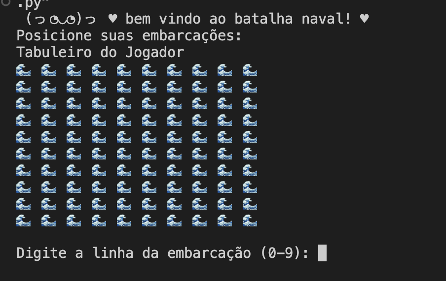
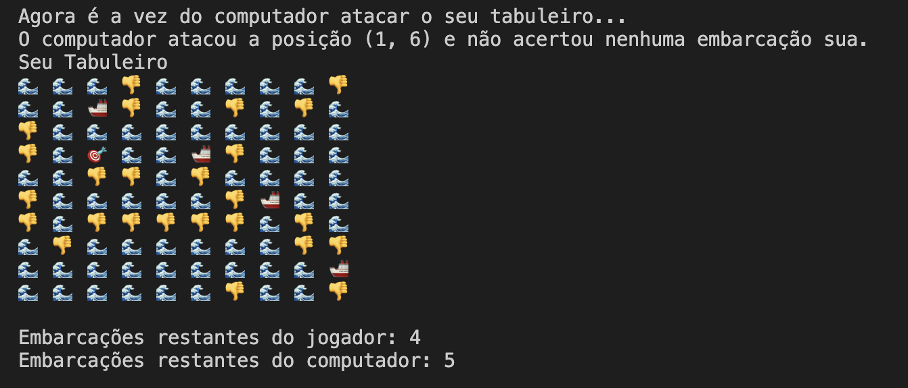

⋆｡ﾟ☁︎｡⋆｡ ﾟ☾ ﾟ｡⋆ BATALHA NAVAL ⋆｡ﾟ☁︎｡⋆｡ ﾟ☾ ﾟ｡⋆
por: Brenda Barbosa e Alana Queiroz

seja bem vindo ao nosso jogo de batalha naval! 
Batalha naval é um jogo onde dois jogadores posicionam tropas em seus tabuleiros, e sem saber onde estão localizadas as tropas adversárias, eles devem atacar o tabuleiro inimigo com o objetivo de afundar as tropas rivais e ganhar o jogo.

⋆｡ﾟ☁︎｡⋆｡ ﾟ☾ ﾟ｡⋆⋆｡ﾟ☁︎｡⋆｡ ﾟ☾ ﾟ｡⋆⋆｡ﾟ☁︎｡⋆｡ ﾟ☾ ﾟ｡⋆⋆｡ﾟ☁︎｡⋆｡ ﾟ☾ ﾟ｡⋆⋆｡ﾟ☁︎｡⋆｡ ﾟ☾ ﾟ｡⋆⋆｡ﾟ☁︎｡⋆｡ ﾟ☾ ﾟ｡⋆⋆｡ﾟ☁︎｡⋆｡ ﾟ☾ ﾟ｡⋆⋆｡ﾟ☁︎｡
Esse jogo foi desenvolvido em Python, usando os conhecimentos adquiridos nas aulas de Raciocínio Algorítmico durante o primeiro período do curso de Ciências da Computação.

ミ★ gameplay ★彡:

o jogo funciona de uma forma simples: primeiramente pedimos ao usuário que posicione suas tropas, e as colocamos no tabuleiro. Após isso, é definida de maneira aleatória as posições das tropas do computador, e seu tabuleiro é ocultado do jogador. Então se inicia a jogatina: o jogador ataca uma linha e uma coluna do tabuleiro do computador, e recebe a informação se afundou ou não uma tropa inimiga. Depois quem joga é o computador, de maneira aleatória, e o usuário descobre se alguma de suas embarcações foi afundada ou não. O jogo continua dessa maneira até que um dos jogadores tenha todas as suas embarcações afundadas pelo adversário.

ミ★ tabuleiro ★彡:

o tabuleiro do jogo possui emojis que deixam a interface mais intuitiva e clara ao usuário

ミ★ legenda ★彡: 

🎯: ataques acertados

🚢: embarcações posicionadas

👎: ataques errados

🌊: água

